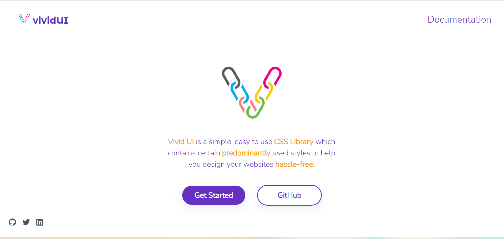
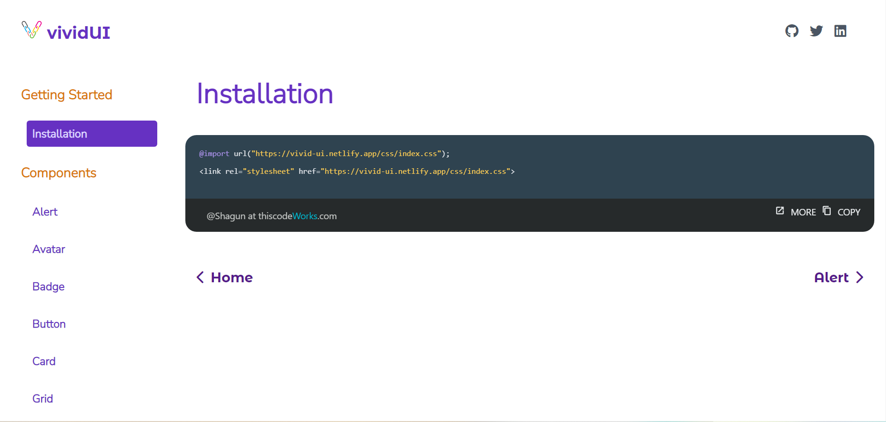

# VIVID UI
Vivid UI is a Component Library created keeping in mind predominantly used styles.

##Installation

Add the following code to your markup, if you wish to use this library locally.

```
	  <link rel="stylesheet" href="https://vivid-ui.netlify.app/css/index.css">
```

## Screenshots



## Documentation
[Documentation](https://vivid-ui.netlify.app/)

## Features
List of Components you'll find in the Library:
- Avatar
- Alert
- Badge
- Button
- Card
- Simplified Grid
- Image
- Input
- Lists
- Typography